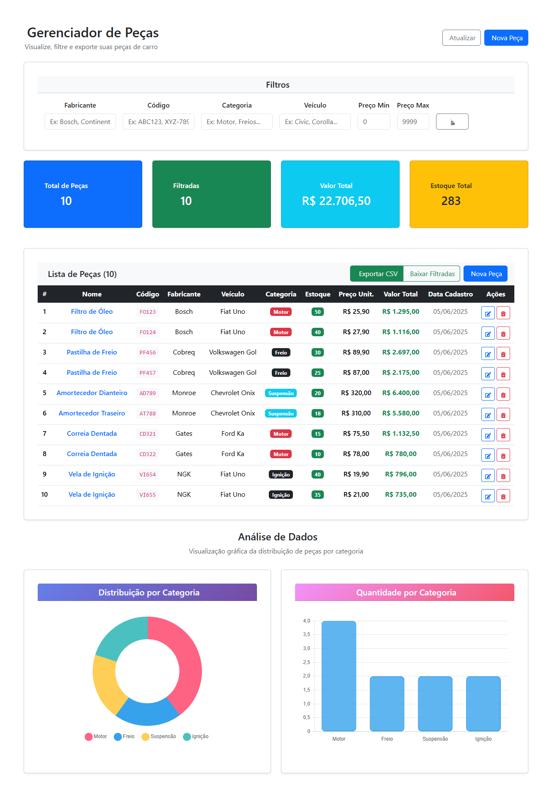
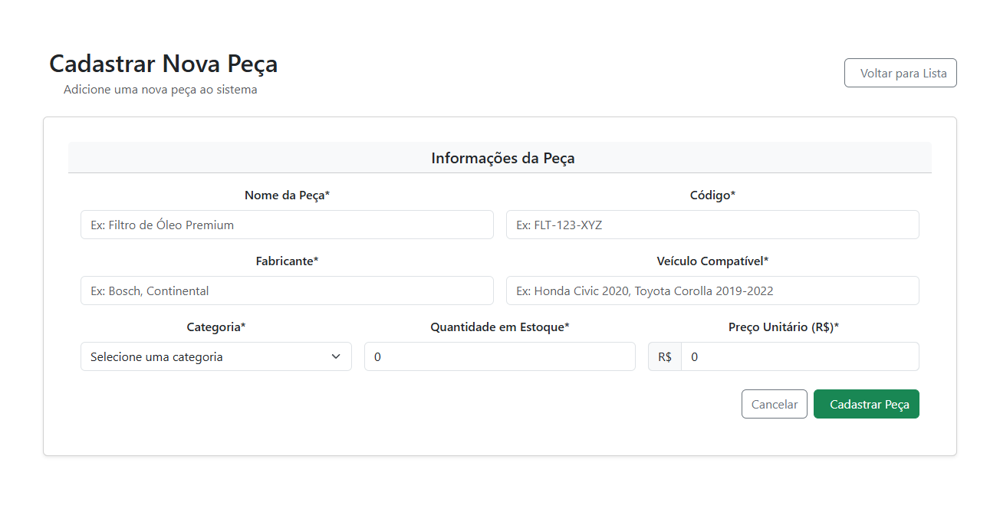

# 🚗 Car Parts Manager

Um sistema completo de gerenciamento de peças automotivas desenvolvido com **Spring Boot** (backend) e **React** (frontend). Gerencie seu estoque de peças com facilidade, visualize estatísticas em tempo real e exporte dados para análise.


## 📋 Índice

- [✨ Funcionalidades](#-funcionalidades)
- [🛠️ Tecnologias](#️-tecnologias)
- [📦 Instalação](#-instalação)
- [🚀 Como Usar](#-como-usar)
- [📊 Screenshots](#-screenshots)
- [🔗 API Endpoints](#-api-endpoints)
- [🤝 Contribuição](#-contribuição)
- [📄 Licença](#-licença)

## ✨ Funcionalidades

### 🎯 **Gestão Completa de Peças**
- ✅ **Cadastro** de novas peças com validação completa
- ✏️ **Edição** de peças existentes com formulário pré-preenchido
- 🗑️ **Exclusão** com confirmação de segurança
- 🔍 **Filtros avançados** por fabricante, categoria, veículo, código e preço

### 📊 **Visualização e Análise**
- 📈 **Gráficos interativos** de distribuição por categoria
- 📋 **Tabela responsiva** com informações detalhadas
- 💰 **Estatísticas em tempo real** (valor total, estoque, etc.)
- 🎨 **Interface moderna** com Bootstrap 5

### 📤 **Exportação de Dados**
- 📄 **Export CSV** via backend com filtros aplicados
- ⬇️ **Download direto** das peças filtradas
- 🏷️ **Nomes inteligentes** de arquivo com filtros e data
- 🔤 **Encoding UTF-8** para caracteres especiais

### 🎨 **Interface Moderna**
- 📱 **Design responsivo** para desktop e mobile
- 🌈 **Cores temáticas** para diferentes categorias
- ⚡ **Loading states** e feedback visual
- 🔔 **Notificações** de sucesso e erro

## 🛠️ Tecnologias

### Backend
- **Java 17+**
- **Spring Boot 3.0+**
- **Spring Data JPA**
- **HSQLDB** (banco em memória)
- **Lombok**
- **Maven**

### Frontend
- **React 18+**
- **Vite**
- **Bootstrap 5.3**
- **Chart.js**
- **Axios**
- **Bootstrap Icons**

## 📦 Instalação

### Pré-requisitos
- **Java 17+**
- **Node.js 16+**
- **npm** ou **yarn**
- **Git**

### 1️⃣ Clone o Repositório
```bash
git clone https://github.com/seu-usuario/car-parts-manager.git
cd car-parts-manager
```

### 2️⃣ Backend (Spring Boot)
```bash
cd carpartsmanager-backend
./mvnw spring-boot:run # ou mvnw.cmd no Windows
```
Backend: `http://localhost:8081`

### 3️⃣ Frontend (React)
```bash
cd carpartsmanager-frontend
npm install
npm run dev
```
Frontend: `http://localhost:5173`

## 🚀 Como Usar

### 1️⃣ **Cadastrar Peças**
1. Clique em **"Nova Peça"**
2. Preencha os campos
3. Clique em **"Cadastrar Peça"**

### 2️⃣ **Visualizar e Filtrar**
1. Use filtros no topo
2. Veja estatísticas e gráficos

### 3️⃣ **Editar Peças**
1. Clique no botão ✏️
2. Edite os campos
3. Clique em **"Atualizar"**

### 4️⃣ **Excluir Peças**
1. Clique em 🗑️
2. Confirme exclusão

### 5️⃣ **Exportar Dados**
1. Aplique filtros
2. Clique em **"Exportar CSV"**

## 📊 Screenshots

### 🏠 Dashboard Principal


### 📝 Formulário de Cadastro


## 🔗 API Endpoints

### 📦 **Peças**
| Método | Endpoint | Descrição |
|--------|----------|-----------|
| `GET` | `/pecas` | Listar todas as peças |
| `POST` | `/pecas` | Cadastrar nova peça |
| `PUT` | `/pecas/{id}` | Atualizar peça |
| `DELETE` | `/pecas/{id}` | Excluir peça |

### 📊 **Estatísticas**
| Método | Endpoint | Descrição |
|--------|----------|-----------|
| `GET` | `/pecas/estatisticas/categorias` | Estatísticas por categoria |

### 📤 **Exportação**
| Método | Endpoint | Descrição |
|--------|----------|-----------|
| `GET` | `/pecas/exportar` | Exportar CSV com filtros |

### 📋 Exemplo de Payload
```json
{
  "nome": "Filtro de Óleo Premium",
  "codigo": "FLT-123-XYZ",
  "fabricante": "Bosch",
  "veiculoCompativel": "Honda Civic 2020",
  "quantidadeEstoque": 50,
  "precoUnitario": 45.90,
  "categoria": "Motor"
}
```

## 🏗️ Estrutura do Projeto

```
car-parts-manager/
├── carpartsmanager-backend/
│   └── src/main/java/com/mattcif/carpartsmanager_backend/
│       ├── controller/
│       ├── model/
│       ├── repository/
│       └── service/
├── carpartsmanager-frontend/
│   ├── src/components/
│   ├── App.jsx
│   └── main.jsx
└── README.md
```

## 🔧 Configuração

### Backend (trocar banco)
```properties
spring.datasource.url=jdbc:postgresql://localhost:5432/carparts
spring.datasource.username=usuario
spring.datasource.password=senha
spring.jpa.database-platform=org.hibernate.dialect.PostgreSQLDialect
```

### Frontend (alterar API)
```javascript
const API_BASE_URL = 'http://localhost:8081';
```

## 📄 Licença

Licenciado sob a **MIT**. Veja [LICENSE](LICENSE).

## 👨‍💻 Autor
• [LinkedIn]([https://linkedin.com/in/seu-perfil](https://www.linkedin.com/in/matheus-fernandes-201aa1170/)) • theus.decif@gmail.com

---

<div align="center">
☕
</div>
